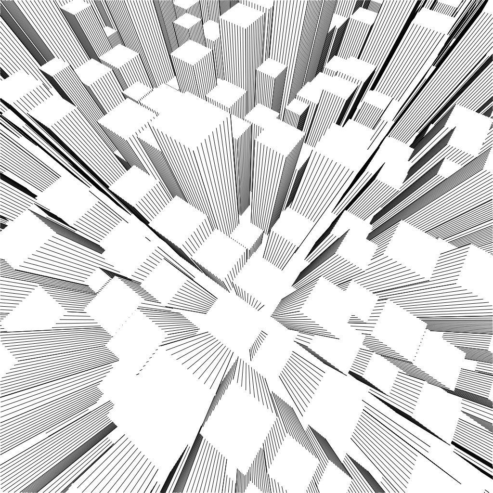

# linea

Demo: [https://muffinman.io/linea](https://muffinman.io/linea)

This is an attempt to port [Michael Fogleman's ln](https://github.com/fogleman/ln), 3d line engine to JavaScript (well, TypeScript).

I used it to generate and plot a couple of drawings:

- [Belgrade](https://muffinman.io/art/belgrade/)
- [Galaxy (black version)](https://muffinman.io/art/galaxy-black/)
- [Galaxy (white version)](https://muffinman.io/art/galaxy-white/)

I'm not really maintaining it anymore, so you might want to check similar projects:

- https://github.com/fogleman/ln - original (in go) that I tried to port to javascript
- https://github.com/aweary/ln.js - more complete js port
- https://github.com/abey79/lines - python version

The name of the port is inspired by the Italian cartoon from the 70s, [La Linea](<https://en.wikipedia.org/wiki/La_Linea_(TV_series)>).

## Setup

Install node 18.2.0 and run:

```
npm install

npm start
```

Then visit http://localhost:1234/

## Tests

```
npm test
```

## Progress

- [x] axis.go
- [x] box.go - done but depends on the missing class `Triangle`
- [x] common.go
- [ ] cone.go - WIP
- [ ] csg.go
- [x] cube.go
- [ ] cylinder.go
- [x] filter.go
- [ ] function.go
- [x] hit.go
- [x] matrix.go
- [ ] mesh.go
- [ ] obj.go
- [x] path.go - missing `WriteTo*` methods, I think we should abstract it a little bit differently
- [ ] plane.go
- [x] ray.go
- [x] scene.go
- [x] shape.go
- [x] sphere.go
- [ ] stl.go
- [x] tree.go
- [ ] triangle.go
- [x] util.go
- [x] vector.go

The first SVG rendered by **linea**:


And the skyscrapers example (please note that this one uses code commented out in `source/cube.ts`):


